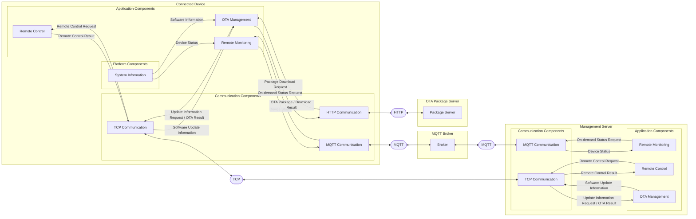

# Component Design

## Connected Device Components 

The connected device software is divided into application, communication, and platform components.

### Application Components

The Application components consists of the following components:
- Remote Monitoring Component
- Remote Control Component
- OTA Management Component

#### Remote Monitoring Component

**Responsibilities**
- collect and report device status periodically
- handle on-demand status requests and report the latest status
- maintain the latest device status 

**Input**
- device status
- periodic reporting trigger 
- on-demand status request

**Output**
- device status for periodic reporting
- device status for on-demand reporting

**Dependencies**
- MQTT communication component
- System Information component

#### Remote Control Component

**Responsibilities**
- receive and execute remote control requests
- report remote control results

**Input**
- remote control requests

**Output**
- remote control results 

**Dependencies**
- TCP communication component

#### OTA Management Component

**Responsibilities**
- request software update information
- download, verify, and apply an OTA package
- verify the update software version
- report the software update results

**Input**
- software update information
- OTA package

**Output**
- software update information requests
- software update results

**Dependencies**
- TCP communication component
- HTTP communication component
- System information component


### Communication Components

The communication components provide network communication services which is used for application components.

It consists of the following components:
- MQTT communication component
- TCP communication component
- HTTP communication component

#### MQTT Communication Component

**Responsibilities**
- manage the connection with MQTT broker
- publish messages
- subscribe to topics
- handle connection failures

**Input**
- published messages 

**Output**
- received MQTT messages
- connection status

**Dependencies**
- None

#### TCP Communication Component

**Responsibilities**
- manage the connection with TCP server
- receive and send messages
- handle connection failures

**Input**
- messages to be sent 

**Output**
- received TCP messages
- connection status

**Dependencies**
- None

#### HTTP Communication Component

**Responsibilities**
- manage the connection with the OTA package server
- send HTTP requests
- receive HTTP responses
- handle the connection failures

**Input**
- OTA package download request

**Output**
- downloaded OTA package
- download result

**Dependencies**
- None

### Platform Components


The platform components provide device system information which is used for application components.

It consists of the system information component.

#### System Information Component

**Responsibilities**
- collect real-time system information from the device
- provide device information required by Applications

**Input**
- system information request 

**Output**
- device system information

**Dependencies**
- None


## Management Server Components

The management server is divided into application and communication components.

### Application Components

The Application components consists of the following components:
- Remote Monitoring Component
- Remote Control Component
- OTA Management Component

#### Remote Monitoring Component

**Responsibilities**
- receive periodic device status
- request and receive on-demand device status

**Input**
- device status
- on-demand monitoring trigger

Output
- on-demand device status request

**Dependencies**
- MQTT communication component

#### Remote Control Component

**Responsibilities**
- send remote control requests
- receive remote control results

**Input**
- remote control trigger
- remote control results

**Output**
- remote control requests

**Dependencies**
- TCP communication component


####  OTA Management Component

**Responsibilities**
- receive software information requests
- determine whether a software update is available
- provide software update information
- receive software update results

**Input**
- software information requests
- software update results

**Output**
- software update information

**Dependencies**
- TCP communication component


### Communication Components

The communication components provide network communication services which is used for application components.

It consists of the following components:
- MQTT communication component
- TCP communication component

#### MQTT communication component

**Responsibilities**
- manage the connection with MQTT broker
- publish messages
- subscribe to topics
- handle connection failures

**Input**
- published messages 

**Output**
- received MQTT messages
- connection status

**Dependencies**
- None

#### TCP Communication Component

**Responsibilities**
- manage the connection with TCP client
- receive and send messages
- handle connection failures

**Input**
- messages to be sent 

**Output**
- received TCP messages
- connection status

**Dependencies**
- None


## MQTT broker Component

**Responsibilities**
- accept connection with MQTT client
- route published message to subscribed clients
- manage MQTT subscriptions

**Connected Interface**
- Connected Device
- Management Server


## OTA Package Server Component

**Responsibilities**
- store OTA packages
- provide OTA package to connected devices through HTTP

**Connected Interface**
- Connected Device


## Component Interaction Diagram




```
