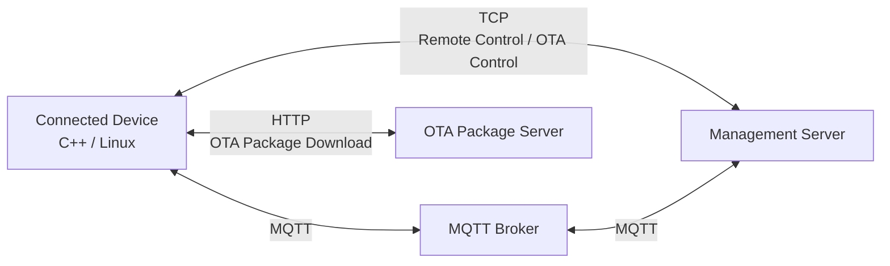

# System Architecture

## 1. Overview

The system consists of a Connected Device, Management Server, MQTT Broker, and OTA Package Server.

The system provides remote monitoring, remote control, and software update through MQTT, TCP, and HTTP communication.

The architecture separates device management, asynchronous status reporting, and OTA package distribution into independent responsibilities.

## 2. System Components

### 2.1 Connected Device

The connected device is a Linux-based device implemented mainly in C++.

This device provides the following functions:

- Remote Monitoring
    - collects device status
    - reports periodic device status through MQTT 
    - receives on-demand device status requests through MQTT
    - responds to on-demand device status requests through MQTT

- Remote Control
    - receives remote control requests through TCP
    - executes supported commands
    - returns command execution results through TCP

- OTA
    - checks for software updates through TCP
    - downloads OTA packages through HTTP
    - verifies and applies OTA packages
    - reports OTA results through TCP

### 2.2 Management Server

The management server manages communication with the connected device and provides the following functions:

- Remote Monitoring
    - receives periodic device status through MQTT
    - sends on-demand device status requests through MQTT
    - receives on-demand device status requests through MQTT

- Remote Control
    - sends remote control requests through TCP
    - receives command execution results through TCP

- OTA Management
    - receives software update check request through TCP
    - determines whether a software update is available
    - sends OTA package information to the device through TCP
    - receives OTA results through TCP

### 2.3 MQTT Broker

The MQTT broker provides asynchronous message delivery between the connected device and the management server.

It is mainly used for remote monitoring.

### 2.4 OTA Package Server

The OTA package server stores and distributes software update packages.

The connected device downloads OTA packages from the server through HTTP.

The server is logically separated from the management server, although both servers run on the same physical host in the initial implementation.
 

## 3. Communication Architecture

### 3.1 Remote Monitoring

MQTT is used for both periodic and on-demand remote monitoring.

The publish/subscribe model allows the connected device to report device status asynchronously through the MQTT broker.

Using MQTT for both periodic and on-demand monitoring keeps the monitoring communication architecture consistent.

### 3.2 Remote Control

A TCP connection provides reliable communication between the connected device and the management server.

TCP is used for direct request/response communication for remote control.

### 3.3 OTA

The OTA communication is separated into control communication and package distribution.

TCP is used for OTA control communication between the connected device and the management server. 
HTTP is used for downloading OTA packages from the OTA package server.

This architecture allows TCP to handle control commands, while HTTP is responsible for transferring software packages.

## 4. System Architecture Diagram

## 5. Requirement Mapping

| Requirements | Components | Communication |
| --- | --- | --- |
| SYS-RM-001, SYS-RM-002 | Connected Device, Management Server, MQTT Broker | MQTT |
| SYS-RM-001 | Connected Device, Management Server | TCP | 
| SYS-OTA-001, SYS-OTA-002 | Connected Device, Management Server, OTA Package Server | TCP, HTTP |

